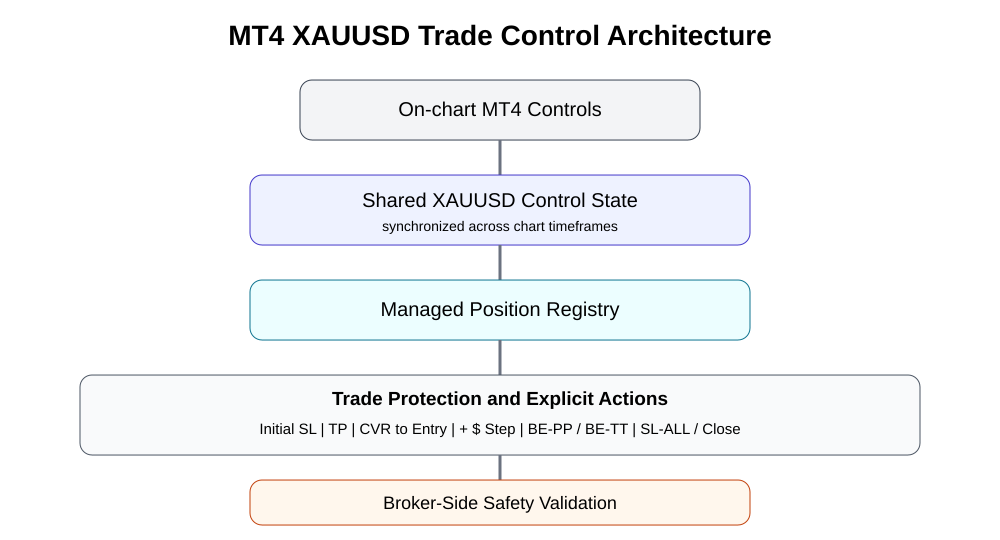
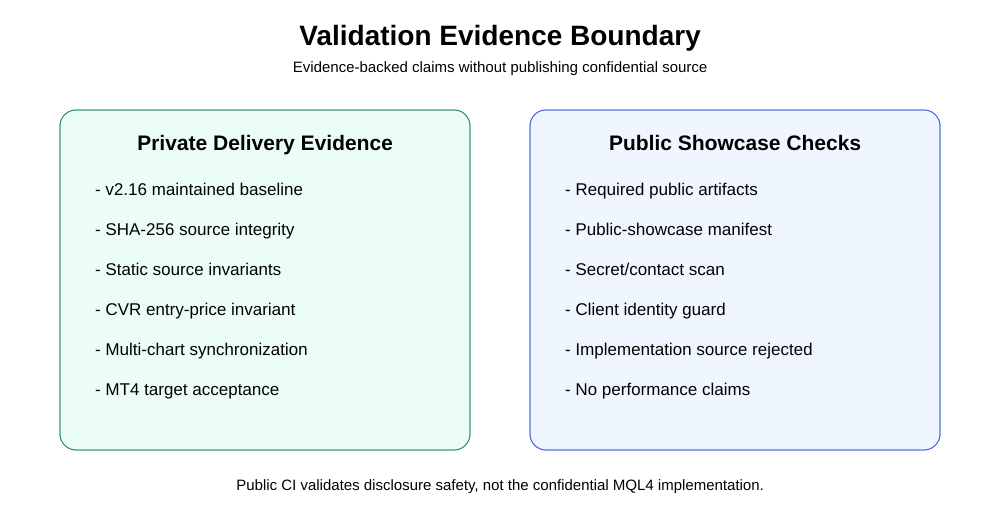

# MT4 XAUUSD Trade Control Manager

Anonymous engineering case study | Trading automation tooling | MetaTrader 4 / MQL4

| Field | Value | Field | Value |
| --- | --- | --- | --- |
| Domain | Trading workflow automation | Target | MetaTrader 4 / XAUUSD workflow |
| Core stack | MQL4, MT4 | Status | Completed, maintenance baseline |

## Executive summary

A manual trade-management Expert Advisor was engineered around a compact chart control surface for position protection and basket management. The engagement required more than wiring buttons to MT4 order functions: the solution had to coordinate the same control values across multiple XAUUSD chart timeframes, protect against broker-invalid stop placement, distinguish settings for future positions from explicit actions on current positions, and refine Cover behavior through live target-environment acceptance.

The final architecture uses synchronized chart state, per-ticket protection state, explicit action handlers, and broker-side price/distance validation. The public case study documents the engineering decisions and acceptance evidence without publishing confidential MQL4 implementation source.

## The challenge

- Multiple XAUUSD chart instances could otherwise compete by applying different values to the same open positions.
- A fallback stop that is merely "broker valid" can still be dangerously close to market if it ignores the configured risk distance.
- Cover logic is sensitive to spread: BUY positions close on Bid and SELL positions close on Ask.
- Break-even requirements existed at both individual-position and total-basket levels.
- Exact manual SL-ALL input needed rejection semantics, not silent rewriting.
- Diagnostic information useful during development became distracting during normal trading and had to be made optional.

## Solution architecture

### Shared state and per-ticket state

Control defaults are synchronized across XAUUSD chart instances so separate timeframes do not alternate TP or other settings. Ticket-specific state is kept separately for trade-level protection decisions.

### Cover as a trigger, not a second target

The final accepted Cover rule separates the **trigger distance** from the **protective level**. When a position has moved at least the configured CVR pips in the favorable executable direction and floating net P/L is positive, the requested protective SL is the position's original entry price. If broker rules do not yet permit that exact stop, the system waits instead of substituting a near-market level.

### Broker-aware stop handling

Stop changes are checked for direction, price normalization, and broker distance constraints. Initial-SL fallback logic preserves at least the configured distance from the current executable market side. Exact SL-ALL values are rejected when unsafe rather than silently moved.

## Engineering highlights

| Area | Engineering result | Area | Engineering result |
| --- | --- | --- | --- |
| Multi-chart controls | Shared settings across XAUUSD timeframes | Cover | Trigger at favorable pips, protect at entry |
| Spread handling | BUY uses Bid, SELL uses Ask for trigger evaluation | Net P/L | Positive floating net guard before Cover |
| Initial SL | Configured-distance fallback instead of near-market fallback | SL-ALL | Exact-price validation with rejection |
| BE-PP | Each position protects at its own entry | BE-TT | Lot-weighted common basket break-even |
| Repeatable step | Current-SL stepping retained across clicks | UI | Debug overlay hidden by default |

## Validation evidence

The private maintained baseline records source checksum integrity and automated static checks. The source contains the expected trade-control actions and the final Cover invariant that targets original entry price after the positive trigger. Target-environment acceptance then confirmed the final Cover behavior in MetaTrader 4.

Public validation deliberately stops at the confidentiality boundary: this repository checks for the required case-study artifacts, rejects implementation-source extensions, and scans text for likely secret/contact material. No private source is copied here.

## Outcome and relevance

The engagement demonstrates practical MT4 engineering where correctness depends on execution semantics and user workflow, not only UI implementation. Relevant capabilities include broker-aware stop management, state coordination across chart instances, per-ticket lifecycle state, basket math, explicit safety guards, and iterative acceptance-driven refinement.

| Capability proof | Relevant project types |
| --- | --- |
| - MT4/MQL4 trade management - Broker-aware order modification - Multi-chart state synchronization - Break-even and basket controls | - Manual trade managers - Risk-control EAs - MT4 workflow tooling - Legacy EA refactoring |

Technology: `MetaTrader 4` · `MQL4` · `XAUUSD` · `GitHub Actions`

## Disclosure and claims boundary

No client identity, account data, private screenshots, payment information, private conversation, broker credentials, private repository URL, or implementation source is included. No profitability, win-rate, ROI, or universal broker-compatibility claim is made.
